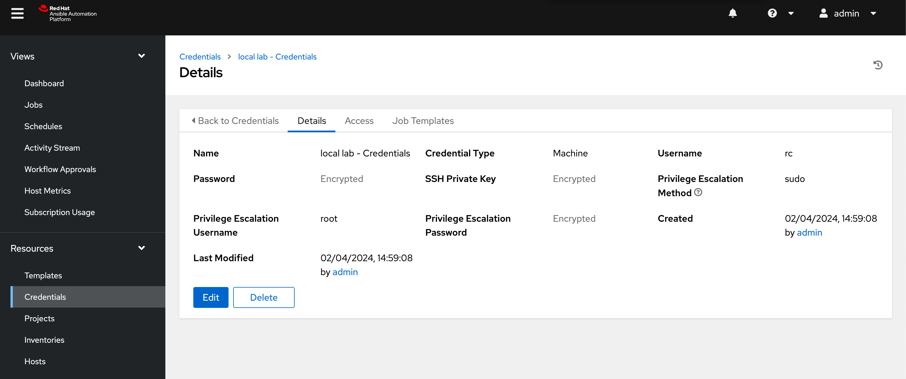
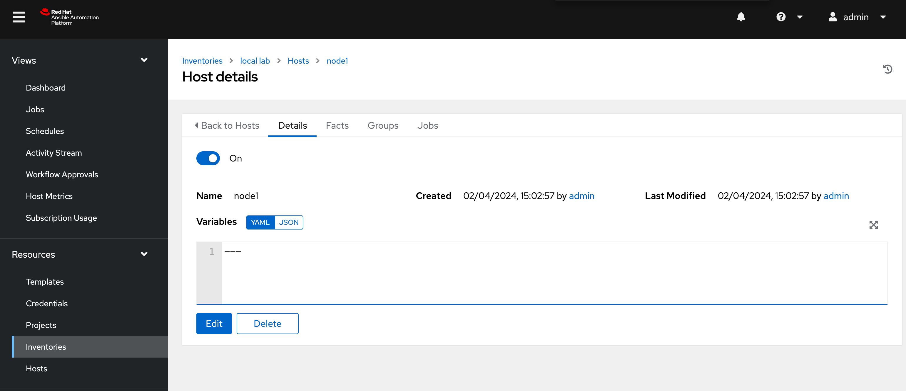
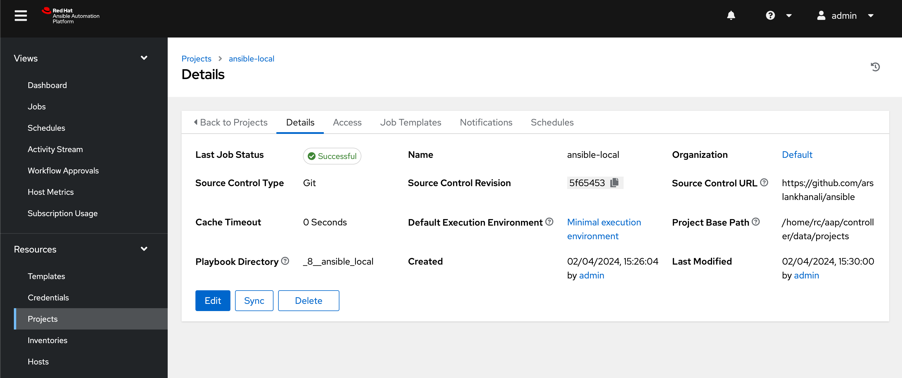
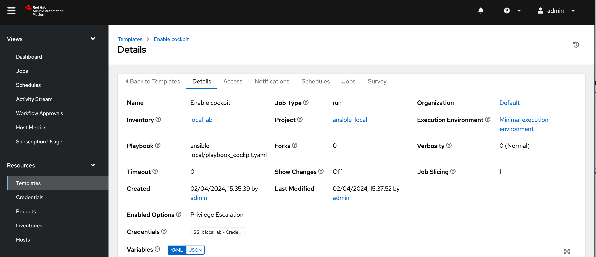

# Add hosts
https://developers.redhat.com/cheat-sheets/ssh-remote-machines-using-ansible

   
1. Create credential using keys/id_rsa
   1. 
   
2. Create Inventory
   1. Add host with just the hostname (node1). I did not need to provide IP
        ```sh
        [rc@aap ~]$  cat /etc/hosts
        172.16.79.145 node1
        172.16.79.146 node2
        172.16.79.147 node3
        172.16.79.147 node3
        ```
    2. 

3. Create a project using git: https://github.com/arslankhanali/ansible
    1. 

4. Create a enable cockpit job template
    1. 

# Bulk import hosts
Documentation: https://docs.ansible.com/automation-controller/latest/html/controllerapi/api_ref.html#/api/api_bulk_host_create_create  

bulk host create: https://node3:8443/api/v2/bulk/host_create/  
Get inventory id from: https://node3:8443/api/v2/inventories/  
bulk-host.json

Can be done via url or execute below
``` sh
curl -k \
     -u admin:fox \
     -X POST \
     -H "Content-Type: application/json" \
     -d @bulk-host.json \
     https://node3:8443/api/v2/bulk/host_create/

# -k -> Ignore SSL
# -u -> username:password
# -X -> Method
# -H -> Header type
# -d -> local file
# url
```